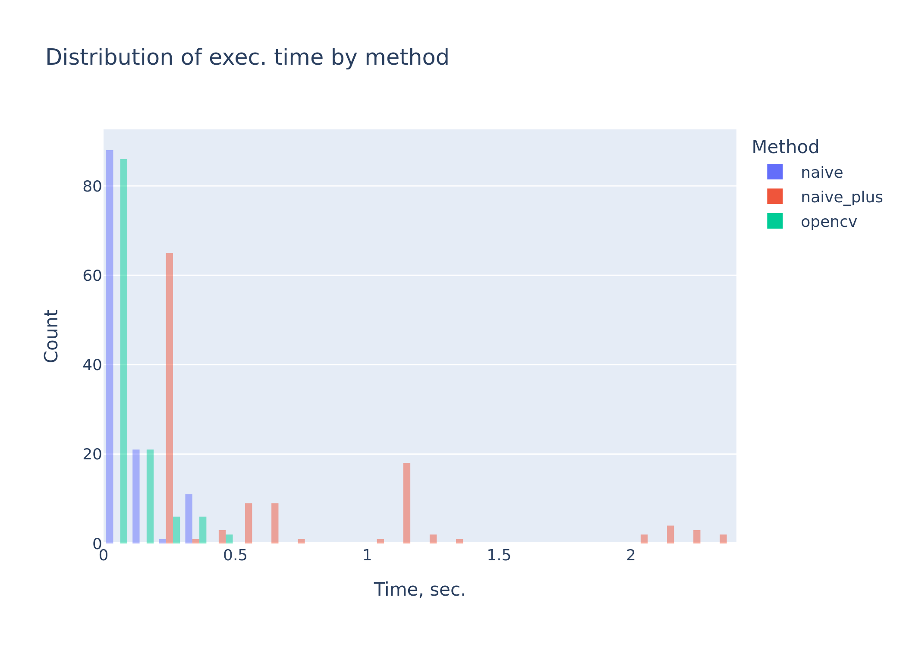
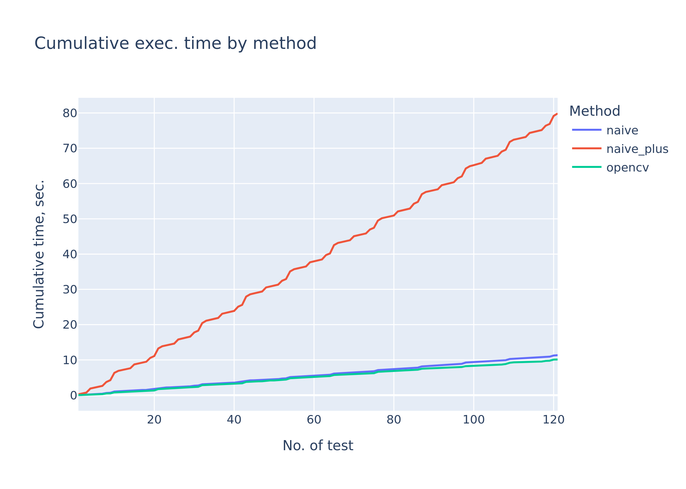

# Chromakey Image Processing: Naive vs OpenCV Implementation

## Цель работы

Целью данной работы является изучение и реализация алгоритма **хромакея** (chroma keying) — технологии замены фона на изображении по заранее заданному цвету. В рамках задания были разработаны два варианта алгоритма:

1. **Нативная реализация на Python** без использования специализированных библиотек.
2. **Оптимизированная реализация на основе библиотеки OpenCV**.

Полученные реализации были протестированы и сравнены по времени выполнения, после чего оформлены результаты и выводы.

---

## 1. Теоретическая база

**Хромакей** — это метод компьютерной обработки изображений, позволяющий выделить объект, снимаемый на монохромном фоне, и заменить этот фон другим изображением. Наиболее часто используются зелёный и синий фон, так как они редко встречаются в оттенках кожи и одежды.

Основные этапы алгоритма:

1. **Определение маски фона** — выделение пикселей, соответствующих фоновому цвету (обычно зелёному).
2. **Формирование маски объекта** — обратная операция, определяющая компонент изображения, который нужно сохранить.
3. **Смешивание изображений** — объединение переднего плана и нового фона.
4. **Опциональная постобработка**: сглаживание границ, фильтрация шумов, подавление цветных ореолов и др.

Использованные материалы:

- Репозиторий с базовыми реализациями хромакея: https://github.com/tobybreckon/chroma-keying
- Статья о реализации эффекта на OpenCV: https://medium.com/fnplus/blue-or-green-screen-effect-with-open-cv-chroma-keying-94d4a6ab2743

---

## Описание разработанной системы

### Архитектура проекта

.
├── datasets/
│ ├── images/ # foreground images
│ └── backgrounds/ # replacement backgrounds
├── results/ # generated chromakeyed images + graphs
├── chromakey.ipynb # core implementations
└── README.md # report

### Реализованные алгоритмы

#### 1) **Нативная реализация (`apply_chromakey_naive`)**

- Поиск зелёных пикселей с помощью порогов по каналам `RGB`
- Простейшая замена фона без сглаживания, маски или фильтров
- Достоинства: легко понять, минимальный код
- Недостатки: артефакты на границах

#### 2) **Усовершенствованная нативная версия (`apply_chromakey_naive_plus`)**

- Вычисление *greenness score*
- Поиск границ методом Собеля
- Медианная фильтрация маски
- Улучшенное качество удаления фона при небольшом увеличении времени вычисления

#### 3) **OpenCV реализация (`apply_chromakey_opencv`)**

- Использование цветового пространства **HSV**
- Автоматическое выделение контура объекта
- Маска на основе `cv2.inRange`, `cv2.findContours`, `cv2.fillPoly`
- Возможность сглаживания (feathering) и точной настройки диапазонов

---

## 3. Результаты работы и тестирования системы

Для сравнения производительности каждая реализация была запущена на **121 паре изображений** (изображение + фоновая текстура)...

### Гистограмма распределения времени выполнения

### Кумулятивный график времени выполнения

### Наблюдаемые закономерности

- **Наивная реализация** — 
- **Улучшенная нативная версия** — 
- **OpenCV реализация** — 

---

## 4. Выводы

В ходе работы было выполнено:

- Разработка трёх вариантов алгоритма хромакея  
- Тестирование на реальных данных  
- Сравнение производительности  
- Визуализация результатов

**Основной вывод:**  

---

## 5. Использованные источники

1. Breckon Toby — *Chroma Keying in Python*  
   https://github.com/tobybreckon/chroma-keying

2. Nikhil Singh — *Blue or Green Screen Effect with OpenCV*  
   https://medium.com/fnplus/blue-or-green-screen-effect-with-open-cv-chroma-keying-94d4a6ab2743

3. OpenCV documentation  
   https://docs.opencv.org/

---
