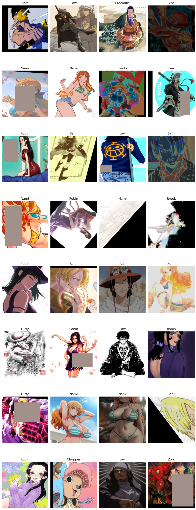
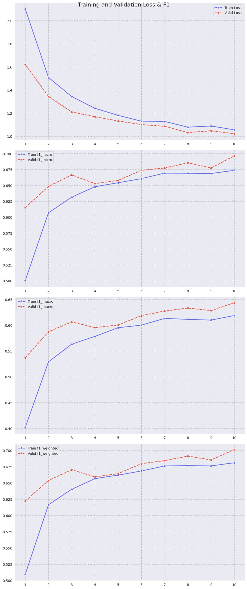
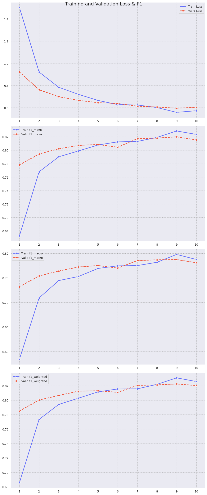
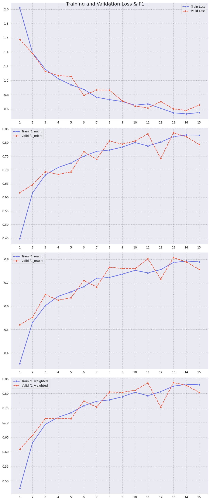

# Классификация персонажей аниме One Piece по изображениям

## Теория

### Задача и метрики

В данном проекте решается задача распознавания персонажей аниме One Piece по изображениям. Это многоклассовая классификация: имеется 18 классов (персонажей), и модель должна по входному изображению определить, какой это персонаж. Поскольку классы несбалансированы (одних персонажей представлено намного больше, чем других), для оценки качества используются метрики F1-score в разных вариантах – micro-F1, macro-F1 и weighted-F1. Метрика F1 является гармоническим средним точности (precision) и полноты, и в случае micro-F1 учитывает вклад каждого образца одинаково (эквивалентно общей доле правильных классификаций для многоклассовой задачи), macro-F1 вычисляется как среднее F1 по классам (в равной мере учитывает качество на каждом классе, что важно при дисбалансе), а weighted-F1 усредняет F1 по классам с весами пропорционально числу образцов каждого класса. Такой набор метрик позволяет оценить как общее качество, так и баланс качества между частыми и редкими классами.

### DL и CV

В задачах компьютерного зрения уже длительное время доминируют *сверточные нейронные сети (CNN)*. Они извлекают иерархические признаки из изображений за счёт локальных свёрток и операций пулинга, что обеспечивает эффективное моделирование пространственной структуры данных. Благодаря этим свойствам CNN на протяжении многих лет демонстрируют высокую точность в задачах классификации, детекции и сегментации изображений.

В последние годы всё большую популярность приобретают модели *Vision Transformer (ViT)*, основанные на механизме внимания (конкретнее, self-attention). В отличие от CNN, ViT обрабатывают изображение как последовательность патчей и моделируют глобальные зависимости между ними с помощью self-attention. Такие модели показывают сопоставимые, а в ряде случаев и лучшие результаты по сравнению со сверточными сетями. При этом ViT, как правило, требуют больших объёмов данных для обучения, поэтому на практике часто используются предобученные версии.

### Архитектуры моделей

В работе выбраны три различные архитектуры — две сверточные (ResNet50 и EfficientNetV2-S) и одна трансформерная (BEiT-base patch16):
► **ResNet50**. Это классическая CNN-архитектура семейства Residual Networks, предложенная еще в 2015 г. Особенность ResNet – наличие residual-блоков с skip connections, которые позволяют эффективно обучать очень глубокие сети, избегая проблем затухающего градиента. Версия ResNet50 содержит 50 слоев и была предобучена на ImageNet. Предобученные веса ResNet50 (ImageNet-1k) достигают точности ~80% Top-1 на ImageNet, что делает эту модель сильным базовым классификатором. Количество параметров ~25,6 млн. ResNet50 имеет фиксированный входной размер изображения – 224×224 (центральный кроп из большего изображения). В обновленной версии предобученных весов используется следующий препроцессированинг входных изображений (на инференсе): масштабирование меньшей из сторон изображения до 232 пикселей c сохранением соотношения сторон, затем центральное кадрирование до изображения размером 224×224 пикселей. В работе ResNet50 был инициализирован предобученными весами (веса после обучения на ImageNet), но обучался полностью с нуля, без замораживания слоев, чтобы адаптировать все фильтры к специфике аниме-изображений.
► **EfficientNetV2-S**. EfficientNet представляет собой семейство сверточных нейронных сетей, спроектированных с целью достижения наилучшего соотношения между точностью и вычислительной сложностью. В основе данного семейства лежит идея согласованного масштабирования архитектуры по нескольким измерениям — глубине сети, ширине слоёв и разрешению входного изображения — с учётом заданного вычислительного бюджета.
EfficientNetV2-S (Small) является одной из моделей второго поколения EfficientNet, представленного в 2021 году, и ориентирована на ускорение обучения и повышение эффективности по сравнению с предыдущей версией. Модель демонстрирует высокую точность на наборе данных ImageNet (Top-1 ≈ 84%) при сравнительно небольшом числе параметров (≈ 21,4 млн).
Архитектура EfficientNetV2-S основана на использовании сверточных блоков MBConv и Fused-MBConv, функции активации Swish, а также механизмов внимания типа Squeeze-and-Excitation, что способствует более эффективному извлечению признаков и улучшению качества классификации.
Предобученные веса EfficientNetV2-S (ImageNet-1k) в PyTorch предполагают входное разрешение 384×384 – изображение сначала масштабируется (resize) до размера 384 по меньшей стороне, затем вырезается центральный квадрат 384×384, и нормализуется по среднему и стандартному отклонению ImageNet. В проекте EfficientNetV2-S использован в режиме трансферного обучения: мы берем предобученную на ImageNet модель (Weights IMAGENET1K_V2) и замораживаем все слои кроме финального классификатора. Обучается только последний полносвязный слой, который был заменен под поставленную задачу (выход 18 классов). Такой подход существенно сокращает требуемое время обучения и снижает риск переобучения, так как основные признаки уже выучены на большом датасете. При замороженном корпусе модели используется исходная нормализация, соответствующая ImageNet, поскольку мы полагаемся на предобученные фильтры, рассчитанные на такие статистики входа.
► **BEiT-base patch16-224**. Это модель семейства Vision Transformer. BEiT расшифровывается как Bidirectional Encoder representation in Transformer для изображений, и концептуально аналогичен BERT в NLP – модель предобучается методом masked image modeling. Конфигурация base/16 означает трансформер базового размера (≈86 млн параметров) с размером патча 16×16 и позиционным кодированием, рассчитанным на изображения размера 224×224. В данной работе выбран предобученный вариант BEiT, доступный через HuggingFace под названием beit-base-patch16-224-pt22k-ft22k-dafre. Эта модель примечательна тем, что она дополнительно дообучена на датасете DAF:re, представляющем собой специализированный датасет аниме-рисунков (Danbooru Anime Faces: revamped). DAF:re содержит ~500 тыс. изображений персонажей аниме (главным образом лица) более чем 3000 классов и является сложным набором данных для распознавания персонажей (многие классы имеют мало образцов). Обученная на DAF:re модель BEiT показала выдающиеся результаты: при тонкой настройке модель BEiT-b/16 на DAF:re достигла 94,84% точности Top-1 на тесте. Это свидетельствует о высокой способности трансформера обобщать знания по специфическому домену. Мы использовали эту модель также в режиме трансферного обучения с замороженным трансформерным энкодером: только последний классификационный слой (добавлен сверху вместо исходного для 3263 классов) обучается на наших данных. Размер входного изображения для BEiT строго 224×224, что соответствует требованиям модели (позиционные эмбеддинги для патчей 16×16 рассчитаны на решетку 14×14 патчей, т.е. 224 пикселей). Таким образом, изображения для этой модели приводятся к квадрату 224×224. Замораживание всех слоев кроме классификатора аналогично линейной настройке (linear probing) – предположительно, предобученные на аниме лица признаки уже достаточно информативны, чтобы различать 18 персонажей One Piece. Этот подход также предотвращает потенциальное перенастройку self-attention слоев на небольшой выборке, что могло бы привести к переобучению или дестабилизации обучения при доменном сдвиге. Как отмечается в публикации по DAF:re, сначала обучение только классификатора на замороженном трансформере делает последующую полную донастройку более устойчивой при наличии расхождения домена между предобученными данными и новой задачей. В нашем случае домен исходных данных (аниме-арты с Danbooru и фан-арты) очень близок к DAF:re, поэтому линейной настройки могло оказаться достаточно для удовлетворительных результатов.

### Метод обучения
Модели обучаются методом градиентного спуска с использованием оптимизатора Adam ($beta_1=0.9$, $beta_2=0.999$) Базовый learning rate установлен равным $10^{-3}$ для всех моделей. Функция потерь – кросс-энтропия. Однако из-за существенного дисбаланса классов были вычислены веса классов для функции потерь: вес $w_k = \frac{\frac{1}{n_k}}{\sum_{j=1}^{K} \frac{1}{n_j}} \cdot K$, где $n_k$ — количество объектов класса $k$, а $K$ — общее число классов. Таким образом, ошибки на редких персонажах штрафуются сильнее, что заставляет модель уделять им больше внимания. Этот прием помогает смягчить эффект дисбаланса, когда без него модель могла бы пренебрегать редкими классами в пользу общей точности на частых.
Кроме того, чтобы избежать переобучения, помимо весов потерь применялись методы регуляризации через аугментацию данных. Аугментация увеличивает разнообразие обучающих изображений за счет случайных геометрических и цветовых преобразований, тем самым улучшая обобщающую способность модели. В работе использован следующий набор основных методов аугментации (применялся только на обучающей выборке):
- RandomResizedCrop(scale=(0.8, 1.0)) – случайное обрезание и масштабирование изображения. Случайный прямоугольник, покрывающий от 80% до 100% исходного изображения, вырезается с случайным соотношением сторон и масштабируется до требуемого размера. Этот прием имитирует случайный зум и кадрирование, повышая устойчивость модели к различным масштабам и положениям объекта на изображении.
- RandomHorizontalFlip(p=0.5) – случайное горизонтальное отражение с вероятностью 50%. Для персонажей аниме горизонтальный флип не меняет идентичности, но меняет ориентацию изображения; это удваивает эффективный объем данных и помогает, например, не привязывать распознавание к определенной стороне лица или одежде.
- TrivialAugmentWide. Это метод автоматической аугментации, предложенный Müller et al., 2021. Суть TrivialAugment – для каждого изображения случайно выбрать одну из набора простых трансформаций (таких как поворот, сдвиг, изменение яркости/цвета и др.) и применить ее с некоторой случайной интенсивностью. Важное свойство – метод не требует подбора гиперпараметров, в отличие от предшественников (AutoAugment, RandAugment). Несмотря на простоту (по одному преобразованию на изображение), TrivialAugment показывает сопоставимый с более сложными методами прирост качества на различных датасетах. В пайплайне TrivialAugment в широком диапазоне (31 уровень интенсивности) добавляет разнообразие и неожиданные искажения изображениям персонажей, что усложняет задачу модели и заставляет ее учиться более устойчивым признакам. Это особенно полезно, учитывая ограниченный размер исходного датасета – аугментация снижает риск переобучения на конкретные особенности обучающих изображений.
RandomErasing(p=0.25, scale=(0.02, 0.25)) – случайное стирание фрагмента изображения. С заданной вероятностью (25%) на каждом обучающем изображении выбирается случайный прямоугольный регион (площадью от 2% до 25% изображения), который затем заменяется шумом.
Пример батча входных изображений после всех преобразований представлен ниже на рисунке 1

**Рисунок 1.** Пример применения аугментаций:

## Разработанная система

### Сбор и подготовка данных

Исходный обучающий датасет взят из соревнования Kaggle по распознаванию персонажей One Piece ([ссылка](https://www.kaggle.com/competitions/one-piece-classification/overview)). В исходных данных было 18 классов и относительно небольшое число изображений в обучающей выборке (~150 на класс). Для повышения качества модели было принято решение расширить датасет дополнительными изображениями, найденными вне Kaggle. В частности, использован ресурс Danbooru, представляющий крупнейшую коллекцию фан-артов и иллюстраций в стиле аниме. Danbooru предоставляет REST API для поиска изображений по тегам. Каждый персонаж на сайте помечается уникальным тегом, поэтому можно выгрузить изображения по имени персонажа.
Для сбора данных был разработан скрипт на Python (в ноутбуке [1_danbooru_scrapper_refactored.ipynb](utils/1.%20danbooru_scrapper_refactored.ipynb)). Загруженные изображения сохранялись с указанием класса (имя персонажа) для последующего объединения.
Далее, ноутбук [2_dataset_mixing_refactored.ipynb](utils/2.%20dataset_mixing_refactored.ipynb) выполняет объединение датасетов: к изначальным Kaggle-изображениям добавляются новые, скачанные с Danbooru. В результате сформировался расширенный корпус данных. Это привело к значительному дисбалансу между классами. Как отмечалось, дисбаланс мы учитываем на этапе обучения через взвешивание классов.
После объединения данные были разделены на обучающую, валидационную и тестовую части. Мы использовали соотношение  70/15/15. Test set в данном контексте – это отложенная часть расширенного набора (который включает Danbooru-данные) и служит для окончательной оценки модели. Помимо этого, у нас был отдельный набор “true test” – это исходный тестовый набор из соревнования Kaggle (изображения, которые использовались для финального рейтинга, без меток в открытом доступе). Поскольку конкурс завершен, мы вручную разметили эти изображения, чтобы иметь возможность вычислить по ним метрики и сравнить результаты. 

### Предварительная обработка изображений

После формирования расширенного датасета выборка стала содержать большое количество изображений высокого разрешения. В сравнении с исходным датасетом с Kaggle-контеста, средний размер изображений в выборке после обогащения стал в 10 раз больше. Из-за специфики чтения изборажений и применения к ним преобразований налету, причем на CPU и последовательно, увеличение среднего размера изображения привело к соответствующему падению производительности всего конвеера обучения. Для оптимизации вычислительной части препроцессинга изображений и более легко их чтения весь датасет, т.е. каждое изображение в нем, был один раз заранее обрезан в соответствии с требованиями соответствующих моделей в пайплайне. Для ResNet50 и EfficientNetV2-S изображения были отмасштабированы до 232 и 384 пикселей по меньшей стороне с сохранением соотношения сторон, в то время как для Beit изображения сразу строго преобразованы в квадраты 224×224. Для первых двух моделей в препроцессинге на этапе обучения будет применена операция кадрирования по центру до необходимых размеров входных изображений, поэтому и масштабирование было не симметричным, а пропорциональным. Beit же в своем препроцессинге отдельного шана кадрирования не предусматривает, поэтому изображение сразу мастшабируется до требуемого.
Помимо изменения размера, все изображения были конвертированы в RGB (некоторые исходники PNG имели альфа-канал, который был отброшен). Также пришлось отказаться от использования PIL для чтения изображений: вместо этого в процессе обучения данные декодируются с помощью torchvision.io.decode_image, что дает небольшой прирост к производительности всего конвеера обучения.

### Обучение моделей

Обучение каждой модели проводилось отдельно, однако настроено схожим образом для сопоставимости результатов. Критерии (функция потерь, оптимизатор, метрики) общие, как описано выше. Различия – в стратегиях обучения также описаны ранее в разделе про архитектуры моделей. Коротко – transfer learning для EfficientNetV2-S и BeiT, причем для BeiT предобучение осуществлялось на данных близкого домена, а ResNet50 обучался с нуля конкретно под нашу выборку.

### Сравнение моделей

**Рисунок 2.** Графики обучения EfficientNetV2-S

**Рисунок 3.** Графики обучения BeiT:

**Рисунок 3.** Графики обучения ResNet50:

**Таблица 1.** Сравнение качества моделей на отложенной выборке (часть расширенного датасета).
| Model         | CE loss | F1 macro | F1 micro | F1 weighted |
|:--------------|:--------|:---------|:---------|:------------|
| efficient_net | 0.9392  | 0.6687   | 0.7264   | 0.7308      |
| beit          | 0.6239  | 0.7783   | 0.8285   | 0.8331      |
| resnet_50     | 0.7398  | 0.7546   | 0.8022   | 0.8127      |

**Таблица 2.** Сравнение качества моделей на отложенной выборке (исходный тестовый датасета контеста).
| Model         | CE loss | F1 macro | F1 micro | F1 weighted |
| :-------------|:--------|:---------|:---------|:------------|
| efficient_net | 0.6540  | 0.7688   | 0.7750   | 0.7720      |
| beit          | 0.2823  | 0.9146   | 0.9152   | 0.9152      |
| resnet_50     | 0.3128  | 0.8937   | 0.8940   | 0.8962      |
